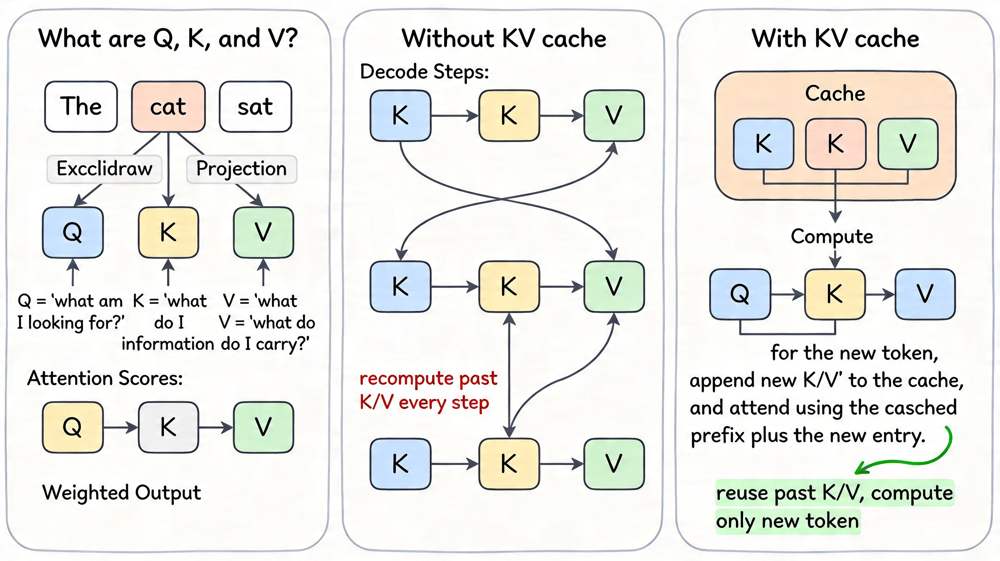

If you've read my previous two posts on vLLM's KV cache manager and its internals, you might have noticed I jumped straight into block allocators and eviction queues without ever stopping to ask: *what is K and V in the first place, and why does caching it matter?* I got a few questions about that, so this post fills that gap. Consider it the post that should have come first.

---

## Attention in One Paragraph

Every transformer layer runs a scaled dot-product attention over three tensors: **Query (Q)**, **Key (K)**, and **Value (V)**. These are not magic — they're just three different linear projections of the same input token embeddings:

```
Q = X · W_Q
K = X · W_K
V = X · W_V
```

Where `X` is the matrix of input token embeddings for the current sequence and `W_Q`, `W_K`, `W_V` are learned weight matrices. The attention output is then:

```
Attention(Q, K, V) = softmax(Q · Kᵀ / √d_head) · V
```

If you've seen this formula a hundred times and it still feels abstract, here's the mental model I find most useful: **Q is the question a token is asking. K is the label each token advertises about itself. V is the actual content a token will contribute if it's selected.** Attention scores are computed by matching Q against every K in the context, softmaxing to get weights, and then summing the V tensors by those weights. The output is a context-aware representation of the current token — informed by everything in its context window.

I want to be precise about one thing: Q, K, and V exist at *every* attention layer, not just once. A 32-layer model produces 32 separate sets of K and V tensors for each token. This matters when we talk about memory costs later.

---

## The Autoregressive Loop

LLMs generate text one token at a time. At each decode step the model receives a growing sequence and outputs one new token:

- **Step 1**: Input is `[token_1]` → generate `token_2`
- **Step 2**: Input is `[token_1, token_2]` → generate `token_3`
- **Step 3**: Input is `[token_1, token_2, token_3]` → generate `token_4`
- ...

This is the **autoregressive** loop. The sequence grows by one token per step, and each step is a full forward pass through the transformer.

Here's the problem: every forward pass must compute Q, K, and V for every token in the sequence. At step N, you compute K and V for tokens 1 through N. At step N+1, you compute K and V for tokens 1 through N+1. But tokens 1 through N didn't change — their K and V tensors at step N+1 are identical to what you computed at step N. You're recomputing the same projections over and over, for every token, at every step.

For a sequence of length L, this makes the total KV computation across all decode steps **O(L²)**. You pay for token 1's K/V projection at every single step until the sequence ends. That's pure waste.

---

## What Caching Solves (and What It Doesn't)

KV caching is the fix. Instead of recomputing K and V for past tokens at each step, you compute them once and **store** them in a buffer — the KV cache. At each subsequent decode step you:

1. Compute Q, K, and V **only for the new token**
2. Append the new K and V to the cache
3. Run attention using the new Q against the **full cached K/V** from all previous tokens
4. Emit the next token

The per-step KV computation drops from O(L) to O(1). But — and this is a point I want to be precise about, because I got sloppy with it in my first post — **you still attend over the full cached context at every step.** Attention itself is O(L) per decode step. KV caching eliminates *redundant computation* of the K/V projections; it does not make attention free. That's a separate problem (addressed by approaches like Sparse Attention, Linear Attention, or sliding-window patterns like Mistral uses — all out of scope here).

So what does caching actually buy you? On a 1024-token sequence, instead of computing 1024 K/V projections at every decode step, you compute exactly 1 per step and reuse the rest. The compute savings are real and significant. The attention cost stays the same either way.


*Left: Q, K, and V are three projections of token embeddings — Q asks a question, K provides a matchable label, V carries the payload. Middle: without caching, you recompute K and V for every token at every step. Right: with caching, past K/V entries live in a buffer and each new step adds exactly one entry.*

---

## The Memory Cost

Nothing is free. Storing all those K and V tensors consumes GPU memory — and the numbers get large quickly.

For a standard 7B-class model in FP16 with multi-head attention — 32 layers, 32 heads, `d_head = 128`:

```
Per-token KV footprint:
= 2 (K and V) × num_layers × num_kv_heads × d_head × sizeof(float16)
= 2 × 32 × 32 × 128 × 2 bytes
= 524,288 bytes
≈ 0.5 MiB per token
```

A single 4096-token sequence occupies **~2 GiB** of KV cache.

One important caveat: this assumes vanilla multi-head attention (MHA) where every head has its own K and V. Many newer models use **Grouped Query Attention (GQA)** — Mistral-7B uses 8 KV heads instead of 32, and LLaMA-3 uses 8 as well. GQA cuts the KV cache footprint proportionally (by 4x in these cases). But even with GQA, the memory pressure is substantial at long context lengths.

For a model like LLaMA-2-13B in FP16 — 40 layers, 40 heads, full MHA — the per-token footprint is closer to 0.78 MiB (I worked through this in [post 1](/posts/01-vllm-kv-cache-manager/)). A 4096-token sequence eats ~3.1 GiB.

On a 40 GB A100 with ~26 GB reserved for model weights, you have roughly 12–14 GB left for KV cache. That's enough for only a handful of concurrent long-context sequences before you're memory-bound — not compute-bound. **Memory capacity, not FLOPS, is the concurrency ceiling for LLM inference.** This is the root cause of everything the KV cache manager exists to solve.

---

## With vs. Without KV Cache

| | Without KV Cache | With KV Cache |
|---|---|---|
| K/V computation per step | O(sequence length) | O(1) — new token only |
| Total K/V compute over generation | O(L²) | O(L) |
| Attention cost per step | O(L) | O(L) — unchanged |
| Memory requirement | None beyond activations | O(L × layers × heads × d_head) |
| Practical constraint | Compute-bound | Memory-bound |

The trade is explicit: you're exchanging compute redundancy for memory pressure. Managing that memory pressure efficiently is the entire point of the KV cache infrastructure stack.

---

## Connecting to the Bigger Picture

Now the next-level problems make more sense:

- **Why block-based allocation?** Because you can't know sequence length upfront, pre-allocating a contiguous max-length slab wastes memory. Paged allocation (PagedAttention) divides the KV buffer into fixed blocks and allocates on demand. I covered this in [post 1](/posts/01-vllm-kv-cache-manager/).

- **Why prefix caching?** If multiple requests share the same system prompt, their K/V tensors for those prefix tokens are identical. Cache them once and skip the prefill cost for every subsequent request. Covered in detail in [post 2](/posts/02-vllm-kv-cache-internals/).

- **Why quantize the KV cache?** At 0.5–0.78 MiB per token (less with GQA, but still significant), even modest context lengths are expensive. INT8 or FP8 KV quantization cuts that footprint in half or more, trading a small accuracy delta for a significant increase in concurrent sequence capacity. That's a topic for a future post.

- **Why does GQA matter beyond parameter count?** It's often presented as a model-size optimization, but the operational impact is KV cache reduction. Fewer KV heads means proportionally less memory per token during inference, which directly translates to higher serving concurrency. If you're evaluating models for production serving, the number of KV heads matters at least as much as total parameter count.

---

## What I Skipped

I deliberately left out multi-query attention (MQA) vs. GQA vs. MHA trade-offs in detail — that's its own post. I also didn't cover how prefill and decode phases interact with the cache differently (prefill fills the cache in one shot, decode extends it token by token), because I covered that in [post 2](/posts/02-vllm-kv-cache-internals/). And I haven't touched KV cache compression techniques beyond mentioning quantization — there's a growing literature on token eviction, attention sinks, and sliding window approaches that deserves a proper treatment.

The point of this post was narrower: if you're going to reason about inference engine internals, you need to know what's actually being cached and why. Everything else builds on that.
